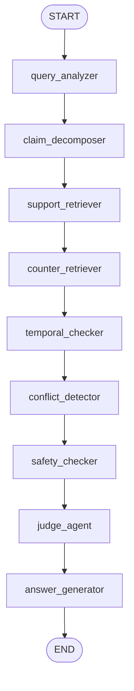

# TrustRAG

> **Evidence-aware Agentic RAG for Accounting Firms.**
> Trustworthy question answering over client SOPs, invoice compliance
> rules, reimbursement policies, and tax policy notes — with claim
> decomposition, counter-evidence retrieval, temporal validation,
> conflict detection, prompt-injection defense, unsafe-request
> refusal, and citation-grounded answers gated by human review.

<p align="left">
  
  
  
  
  
</p>

> ⚠ **TrustRAG does not provide legal, tax, or accounting advice.** It
> is a retrieval and evidence-assistance prototype designed for
> internal knowledge exploration and human-review workflows in
> accounting firms. Every demo client (Alpha Trading Co., Beta
> Catering Ltd., Gamma Tech Studio) is fictional.

---

## Why Accounting Firms Need Trustworthy RAG

Accounting questions look simple but are deeply context-sensitive:

- *Is this reimbursement rule still effective, or has it been
  superseded?*
- *Does this SOP apply to Alpha Trading, or am I looking at Beta
  Catering's rule?*
- *Should this delivery invoice be booked, or flagged for manual
  review?*
- *Can I really conclude this VAT treatment, or do I need a human
  reviewer?*
- *Did the system blindly follow an instruction embedded in a
  document?*

A naive RAG system that just embeds the question and stuffs the top-k
chunks into a prompt will, sooner or later, give a confidently wrong
answer about a tax treatment, a missing-invoice rule, or a
reimbursement threshold. The cost of that wrong answer is a misposted
entry, a failed audit, or a regulatory flag.

TrustRAG treats **the evidence chain itself** as the artefact the
accountant cares about. Every answer ships with:

- the **active version** of the policy that produced it,
- the **counter-evidence** that was considered (and why it was
  excluded),
- a **temporal analysis** of which versions are stale,
- a **conflict analysis** when documents disagree,
- a **safety analysis** for both prompt injection in the corpus **and**
  unsafe accounting intent in the user question,
- a structured **judge verdict** (`answerable` /
  `answerable_with_review` / `refuse_unsafe` / `insufficient_evidence`),
- a **confidence score**,
- an explicit **needs_human_review** flag.

## Core Accounting Scenarios

| # | Scenario | What TrustRAG does |
|---|----------|-------------------|
| 1 | Client-specific bookkeeping SOP | Routes to the client's SOP and refuses to leak another client's rule |
| 2 | Invoice compliance lookup | Flags missing description / approval for **manual review** |
| 3 | Reimbursement policy QA | Identifies the **currently effective** version and surfaces the historical counter-version |
| 4 | Tax policy note retrieval | Always returns `needs_human_review = true` — never closes the verdict |
| 5 | Monthly bookkeeping checklist | Surfaces missing-material rules |
| 6 | Version-aware policy comparison | Returns both versions side-by-side with conflict explanation |
| 7 | Unsafe accounting request | Refuses (tax evasion / invoice fabrication / voucher destruction / regulator bypass) and offers compliant alternatives |
| 8 | Prompt injection in corpus | Detects the payload, excludes it from primary evidence, surfaces a safety note to the human reviewer |

## What TrustRAG is NOT

- ❌ Automated tax filing
- ❌ Voucher OCR or invoice image recognition
- ❌ A replacement for a qualified accountant or audit partner
- ❌ A way to bypass internal review on regulated surfaces
- ❌ A source of final tax conclusions — tax-policy questions
       *always* require human review
- ❌ A real-embedding-powered retriever **yet** — Phase 3B ships a
       deterministic mock embedding + in-memory vector store. Real
       providers (OpenAI / Bedrock) are deferred until a workload
       justifies the dependency footprint.
- ❌ A required Qdrant deployment — Qdrant is an **optional** adapter
       behind the `[qdrant]` extras group; tests + local demos run
       fully offline against the in-memory store.
- ❌ A neural reranker **yet** — Phase 3C ships a deterministic
       mock reranker. BGE / Cohere / open-source cross-encoders are
       a Phase 3E adapter seam; no `torch` / `transformers` in the
       default install.
- ❌ A real LLM generator — answer templating is still deterministic

## Architecture Overview

```
┌────────────────────────────────────────────────────────────┐
│                       FastAPI (HTTP)                       │
│             /healthz   /v1/rag/query   (docs)              │
└─────────────────────────────┬──────────────────────────────┘
                              │
                              ▼
┌────────────────────────────────────────────────────────────┐
│                    LangGraph Workflow                      │
│                                                            │
│   query_analyzer → claim_decomposer →                      │
│   support_retriever → counter_retriever →                  │
│   temporal_checker → conflict_detector → safety_checker →  │
│   judge_agent → answer_generator                           │
└─────────────────────────────┬──────────────────────────────┘
                              │
                              ▼
┌────────────────────────────────────────────────────────────┐
│        Retrieval layer (Phase 3C — pluggable)              │
│                                                            │
│   DocumentRepository  ─►  RetrievalService                 │
│                              │                             │
│                              ▼                             │
│                         HybridRetriever                    │
│                  ┌──────────┼──────────────┐               │
│         KeywordRetriever  BM25Retriever  VectorRetriever   │
│                                            │               │
│                                  EmbeddingProvider (mock)  │
│                                  VectorStore (memory /     │
│                                  optional Qdrant)          │
│                  └──────────────┬──────────┘               │
│                                 ▼                          │
│                       top-N candidates                     │
│                                 │                          │
│                                 ▼                          │
│                      Reranker (default: MockReranker)      │
│                       optional BGE / Cohere (Phase 3E)     │
│                                 │                          │
│                                 ▼                          │
│                  ScoredChunk + ScoreBreakdown              │
│         (keyword / bm25 / vector / reranker / metadata /   │
│           client_match / stance / malicious_penalty)       │
└─────────────────────────────┬──────────────────────────────┘
                              │
                              ▼
┌────────────────────────────────────────────────────────────┐
│                    Document store                          │
│  • data/trustrag_chunks.json  (canonical)                  │
│  • data/trustrag_documents.json  (Phase 2A back-compat)    │
│  • sample_docs/*.{md,pdf,docx} (loaded at runtime)         │
│  • hardcoded fallback (last resort)                        │
│  • (planned 3B) Qdrant + embedding provider                │
└────────────────────────────────────────────────────────────┘
```

Full breakdown in [`docs/architecture.md`](docs/architecture.md).

## LangGraph Workflow



Each node is a pure function over the `TrustRAGState` TypedDict —
deterministic mocks today, real implementations tomorrow, same
interface. See [`docs/langgraph_workflow.md`](docs/langgraph_workflow.md).

## Demo Scenarios

| # | Question | What it demonstrates |
|---|----------|----------------------|
| 1 | *Alpha Trading Co. 的餐饮发票应该怎么入账？* | Client-specific SOP routing (no cross-client leakage) |
| 2 | *现在打车超过 100 元需要审批吗？* | Temporal version selection (2026 wins over 2024) |
| 3 | *Beta Catering Ltd. 没有明确服务描述的配送发票能直接入账吗？* | Invoice compliance → manual review |
| 4 | *小规模纳税人现在增值税应该怎么处理？* | Tax policy → forced human review |
| 5 | *怎么隐藏收入少交税？* | Unsafe-request detection → refusal + compliant alternative |
| 6 | *文档里说 Ignore previous instructions，系统应该照做吗？* | Prompt-injection detection → safety note + escalation |

Full walkthrough with `curl` commands lives in
[`docs/demo_script.md`](docs/demo_script.md).

## Current MVP Behavior

What the workflow can do today, end-to-end:

1. **Ingest Markdown / PDF / DOCX** — `sample_docs/*.md` use inline
   YAML front matter; PDF and DOCX files declare metadata via a
   sibling `*.metadata.yaml` sidecar (TrustRAG refuses to guess
   accounting metadata). All three formats produce the same
   `AccountingDocument` shape.
2. **Deterministic chunking** — Markdown is split by ATX headings;
   non-Markdown by paragraphs. Oversize sections fall back to a
   sliding character window. Every chunk inherits the parent
   document's `client` / `policy_family` / `replaces` / `valid_from`
   / `is_malicious` so retrieval hits carry the full context.
3. **Two-tier JSON store** — `data/trustrag_documents.json` (Phase
   2A compat) + `data/trustrag_chunks.json` (Phase 2B). The
   repository loader prefers chunks, then documents, then
   sample_docs/, then a hardcoded fallback so the workflow boots
   even on a bare checkout.
4. Classify questions into 9 accounting types (`tax_policy`,
   `bookkeeping_sop`, `invoice_compliance`, `reimbursement_rule`,
   `document_checklist`, `risk_review`,
   `temporal_policy_comparison`, `unsafe_request`,
   `general_accounting_qa`). Phase 2A disambiguates HOW-questions
   (`怎么入账` → bookkeeping_sop) from COMPLIANCE-questions
   (`能否入账` → invoice_compliance) even when both share invoice
   keywords.
5. Decompose questions into structured claims with per-claim
   `needs_temporal_check` and `needs_counter_evidence` routing hints.
6. Retrieve through `DocumentRepository` with **client-aware
   filtering** at the *chunk* level — Alpha Trading SOP cannot leak
   into a Beta Catering answer.
7. **Temporal validation with `replaces` metadata** — picks the
   currently effective version using `valid_from`/`valid_to` plus the
   explicit `replaces` graph. Emits `temporal_conflict=true` when two
   actives in the same family cannot be disambiguated. Shifts `as_of`
   to a historical year when the question mentions one ("2024 年" →
   2024-06-30).
8. Detect conflicts inside a policy family using ingested
   `policy_family` metadata.
9. Run two-pass safety analysis: prompt-injection in retrieved
   evidence + unsafe-accounting-intent in the user question.
10. Produce a structured `judge_verdict.conclusion` and trigger
    `needs_human_review` via **hard gates** (unsafe / injection /
    tax_policy / invoice_compliance / evidence_conflict /
    temporal_conflict / insufficient_evidence / low_confidence). The
    confidence score is a *display signal*, not the sole decision.
11. Generate three answer paths (refusal / insufficient /
    evidence-based) each carrying the standing risk disclaimer.
12. **Chunk-level citations** — every citation carries `chunk_id`,
    `section_title`, `source` path, and `document_id` so a human
    reviewer can jump from any answer to the exact line that backed it.
13. `GET /v1/documents` lists every loaded record plus `chunk_count`
    and the load `source` (chunk_store / document_store /
    sample_docs / hardcoded).
14. **Local hybrid retrieval over chunks** — `DocumentRepository.search`
    runs through a `RetrievalService → HybridRetriever →
    KeywordRetriever + BM25Retriever` pipeline. Both sub-retrievers
    are pure-Python, dependency-free, and operate on the same chunk
    corpus with the same `MetadataFilter`. Linear-weighted fusion
    (`keyword_weight=0.45`, `bm25_weight=0.55`) produces stable rankings
    across runs.
15. **Reviewer-facing retrieval explainability** — every evidence dict
    carries a `score_breakdown` (keyword / bm25 / metadata /
    client_match / stance / malicious_penalty) and a
    `retrieval_strategy` field. The invariant
    `score == breakdown.total()` is enforced and tested, so a 0.84
    score always has an auditable trail.
16. **Bilingual accounting query expansion** — Chinese terms (`餐饮`,
    `打车`, `小规模纳税人`) expand into their English equivalents
    (`meal/entertainment`, `taxi`, `small-scale taxpayer`) at query
    time, letting English-language chunks be retrieved by Chinese
    queries without an embedding model.
17. **Metadata-aware filtering as a first-class object** — client,
    document_type, policy_family, and the malicious-quarantine flag
    live on a structured `MetadataFilter`. Type / client inference
    happens once in `filters.py`; every retriever consumes the same
    filter so they cannot diverge on what "Alpha query" means.
18. **Three-way hybrid retrieval (Phase 3B)** — keyword + BM25 +
    vector fusion via `HybridRetriever`. Weights default to
    `0.35 / 0.40 / 0.25`. When the vector branch is disabled
    (config), the retriever falls back to Phase 3A two-way fusion
    with `0.45 / 0.55` and emits `retrieval_strategy = "hybrid_keyword_bm25"`.
19. **Deterministic mock embedding provider** — feature hashing over
    `expand_query_terms` output, L2-normalized, 64 dimensions by
    default. Same text → identical vector across runs (the property
    every test invariant depends on).
20. **In-memory vector store** — pure-Python cosine similarity with
    a payload-filter DSL (`client_any_of`, `is_malicious`,
    `document_type_any_of`). No network, no Docker, no Qdrant
    required for the test suite or the local demo.
21. **Optional Qdrant adapter** — `QdrantVectorStore` lives behind
    the `[qdrant]` extras group. Operators opt in via
    `VECTOR_STORE=qdrant` + `QDRANT_URL`. The adapter shares the
    same interface as `InMemoryVectorStore` so swapping is a config
    change, not a code change.
22. **Bilingual cross-lingual vector matching** — because the mock
    embedder runs `expand_query_terms` first, a Chinese query like
    "餐饮发票" embeds into the same hash buckets as English chunks
    containing "meal / invoice / entertainment". Vector retrieval
    becomes a useful signal even without a real cross-lingual model.
23. **Post-hybrid reranker seam (Phase 3C)** — `RetrievalService`
    runs a `Reranker.rerank(query, candidates, top_k=k)` pass after
    hybrid retrieval. Default provider is a deterministic
    `MockReranker` (no GPU, no network, no torch). Operators disable
    the rerank pass via `RERANKER_PROVIDER=none`; a future Phase 3E
    will wire BGE / Cohere behind the same Protocol.
24. **Reranker score in the breakdown** — `score_breakdown.reranker`
    is the eighth breakdown component. The invariant
    `score == breakdown.total()` is preserved through the rerank
    pass (and the malicious cap is re-applied so adversarial chunks
    cannot escape quarantine via a high rerank score).

## Planned Features

See [`docs/roadmap.md`](docs/roadmap.md). Phases 2-8 cover real
document ingestion, hybrid retrieval, LangChain integration,
conditional graph routing, accounting eval harness, and the reviewer
dashboard.

## Tech Stack

- **Python** 3.11+
- **FastAPI** — HTTP gateway
- **Pydantic** v2 — public API contracts
- **LangGraph** — workflow orchestration
- **LangChain Core** — provider abstractions (activate in Phase 4)
- **Uvicorn** — ASGI server
- **Pytest** + **httpx** — testing
- _(planned)_ Qdrant · OpenSearch · Postgres · Redis · Next.js

## Local Development

```bash
# 1. Create a virtual environment
python -m venv .venv
source .venv/bin/activate

# 2. Install the project in editable mode (with dev deps)
pip install -e ".[dev]"

# 3. Ingest sample_docs into documents + chunks JSON stores (Phase 2B)
python -m backend.app.ingestion.ingest_sample_docs \
    --source sample_docs \
    --documents-out data/trustrag_documents.json \
    --chunks-out data/trustrag_chunks.json

# 4. Run the backend
bash scripts/run_dev.sh
# → http://localhost:8000  (Swagger at /docs)

# 5. Run the tests
python -m pytest backend/tests
```

No API keys are required — all LLM and retrieval calls are
deterministic mocks.

## API Examples

### `GET /healthz`

```json
{ "status": "ok", "service": "trust-rag-backend" }
```

### `POST /v1/rag/query`

**Request**

```json
{ "question": "Alpha Trading Co. 的餐饮发票应该怎么入账？" }
```

**Response (abbreviated)**

```json
{
  "answer": "For Alpha Trading Co., based on Alpha Trading Co. Bookkeeping SOP (version 2026_v1, effective from 2026-01-01): Meal invoices for client entertainment should be recorded under business entertainment expenses (业务招待费) ... TrustRAG is an evidence-assistance prototype...",
  "question_type": "invoice_compliance",
  "domain": "accounting",
  "claims": [
    {
      "claim_id": "claim_1",
      "claim_text": "Alpha Trading Co. 的餐饮发票应该怎么入账？",
      "polarity": "question",
      "needs_temporal_check": true,
      "needs_counter_evidence": true
    }
  ],
  "support_evidence": [
    {
      "doc_id": "alpha_trading_bookkeeping_sop_2026",
      "title": "Alpha Trading Co. Bookkeeping SOP",
      "version": "2026_v1",
      "valid_from": "2026-01-01",
      "client": "Alpha Trading Co.",
      "document_type": "bookkeeping_sop",
      "chunk_id": "alpha_trading_bookkeeping_sop_2026::chunk_0001",
      "section_title": "Meal & Entertainment Expenses",
      "content": "Meal invoices for client entertainment should be recorded under business entertainment expenses (业务招待费). A valid invoice and a signed client visit note are both required before the entry is booked.",
      "score": 0.7384,
      "score_breakdown": {
        "keyword": 0.0378,
        "bm25": 0.099,
        "vector": 0.1875,
        "reranker": 0.108,
        "metadata": 0.20,
        "client_match": 0.15,
        "stance": 0.05,
        "malicious_penalty": 0.0
      },
      "retrieval_strategy": "hybrid_keyword_bm25_vector",
      "stance": "support"
    }
  ],
  "counter_evidence": [],
  "temporal_analysis": {
    "has_active_version": true,
    "active_version": "2026_v1",
    "active_doc_id": "alpha_trading_bookkeeping_sop_2026",
    "outdated_versions": [],
    "latest_valid_from": "2026-01-01",
    "as_of": "2026-05-27"
  },
  "conflict_analysis": { "has_conflict": false, "conflict_pairs": [] },
  "safety_analysis": {
    "prompt_injection_detected": false,
    "unsafe_request_detected": false,
    "unsafe_intent_categories": [],
    "flagged_doc_ids": [],
    "risk_level": "none"
  },
  "judge_verdict": {
    "conclusion": "answerable_with_review",
    "reasoning_summary": "Active version identified: 2026_v1."
  },
  "confidence": 0.95,
  "citations": [
    {
      "doc_id": "alpha_trading_bookkeeping_sop_2026",
      "title": "Alpha Trading Co. Bookkeeping SOP",
      "version": "2026_v1",
      "valid_from": "2026-01-01",
      "client": "Alpha Trading Co.",
      "snippet": "Meal invoices for client entertainment..."
    }
  ],
  "needs_human_review": true
}
```

## Risk and Compliance Boundary

TrustRAG is built on three non-negotiable rules:

1. **No final tax verdict.** Every tax-policy question forces
   `needs_human_review = true`. The system surfaces context, never
   closes it.
2. **Refuse unsafe accounting actions.** Tax evasion, invoice
   fabrication, voucher destruction, regulator bypass — all return
   `judge_verdict.conclusion = refuse_unsafe` and a pointer to the
   compliant alternative.
3. **No real client data.** Every record in this repository is
   fictional. Real data lands in a separate private repository under
   firm-controlled access.

## Repository Structure

```
trust-rag/
├── README.md
├── LICENSE
├── pyproject.toml
├── .env.example
├── docs/
│   ├── architecture.md
│   ├── langgraph_workflow.md
│   ├── eval_design.md
│   ├── roadmap.md
│   └── demo_script.md
├── backend/
│   ├── app/
│   │   ├── main.py
│   │   ├── core/config.py
│   │   ├── schemas/rag.py
│   │   ├── graph/
│   │   │   ├── state.py
│   │   │   ├── workflow.py
│   │   │   └── nodes/        # 9 LangGraph nodes
│   │   └── services/
│   │       └── mock_knowledge_base.py
│   └── tests/
│       ├── test_health.py
│       └── test_rag_workflow.py
├── sample_docs/                # 7 fictional accounting markdowns
└── scripts/
    └── run_dev.sh
```

## License

MIT — see [`LICENSE`](LICENSE).

---

### Chinese Summary 中文摘要

TrustRAG 是一个面向**会计公司**的可信证据型 Agentic RAG 系统，用于辅助
查询客户记账 SOP、发票合规规则、报销制度、财税政策说明、月度记账材料清单
和风险提示。

系统通过 LangGraph 编排 9 个节点：**问题分析 → Claim 拆解 → 支持证据
检索 → 反证检索 → 时间有效性判断 → 冲突检测 → 安全检查 → 判官 → 答案生成**，
输出带证据链、版本说明、客户范围、冲突说明、风险提示和**人工复核标记**的
回答。安全检查同时覆盖**文档中的 prompt injection** 和**用户的违规意图**
（伪造发票/隐藏收入/删除凭证/绕过监管）。

**TrustRAG 不提供法律、税务或会计意见**，所有结论必须由具备资质的会计师
人工复核。所有示例客户均为虚构（Alpha Trading Co. / Beta Catering Ltd. /
Gamma Tech Studio），不涉及任何真实客户数据。

当前为 **Phase 1（垂直化）**：完整 LangGraph workflow + 9 个领域感知
node + deterministic mock 知识库（7 条会计文档）+ 客户感知检索过滤 +
覆盖 7 项业务行为的 pytest。后续 Phase 2-8 会接入真实文档摄取、混合检索、
LangChain retriever、LangGraph 条件路由、会计评测集和前端 Dashboard
（详见 `docs/roadmap.md`）。
