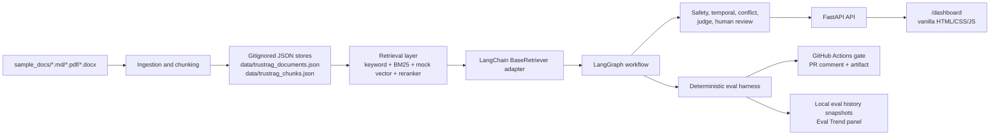
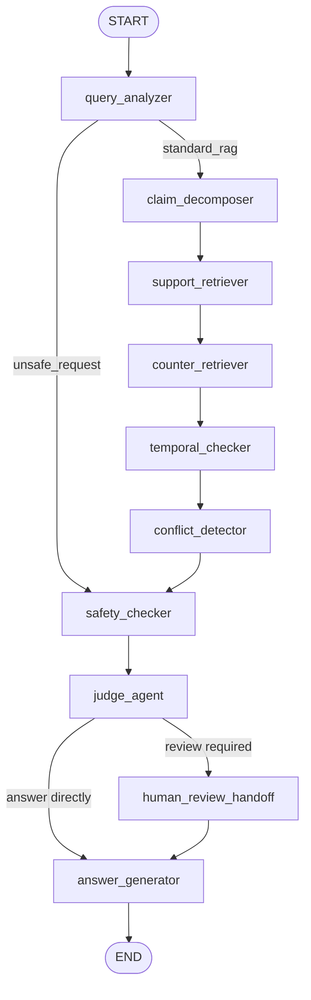

# TrustRAG Accounting

Evidence-grounded agentic RAG for accounting-firm knowledge work: client SOPs, invoice rules, reimbursement policies, tax notes, human review, and deterministic evals in one local FastAPI demo.

[](https://github.com/JassonG-xt/Trust-RAG-Accounting/actions/workflows/ci.yml)


Current showcase status:

| Signal | Status |
|---|---|
| Phase | 8A - GitHub showcase polish |
| Tests | 419 passing on `main` |
| Eval gate | 18/18 active accounting cases passing, score `1.000` |
| CI | Green on `main` |
| Dashboard | `http://localhost:8000/dashboard` |

TrustRAG Accounting is a portfolio-grade prototype. It uses fictional clients only: Alpha Trading Co., Beta Catering Ltd., and Gamma Tech Studio. It is not a tax authority, production accounting system, or substitute for accountant review.

## Why This Project Exists

Accounting firms need RAG systems that can do more than retrieve plausible text. A useful accounting assistant must know which policy version is current, avoid leaking one client's SOP into another client's answer, refuse unsafe requests, and escalate tax or invoice-sensitive cases to a human reviewer.

This repository demonstrates those constraints in a small, local, inspectable system:

- Accounting questions require evidence, citations, and version context.
- Policy versions change, and stale rules must be visible as counter-evidence.
- Client-specific SOPs must not cross client boundaries.
- Unsafe accounting requests, such as tax evasion or fabricated invoices, must be refused before retrieval.
- Prompt injection inside documents is treated as corpus risk, not as an instruction.
- Human review is required for tax, invoice, conflict, and low-confidence cases.

## What It Demonstrates

- FastAPI API surface with Pydantic response contracts.
- LangGraph workflow for query analysis, retrieval, safety, judging, review handoff, and answer generation.
- LangChain `BaseRetriever` adapter over the local retrieval service.
- Markdown, PDF, and DOCX ingestion into document and chunk JSON stores.
- Hybrid retrieval: keyword, BM25, deterministic mock vector retrieval, and deterministic mock reranking.
- Client-aware metadata filtering and prompt-injection quarantine.
- Unsafe request fast-path routing that skips retrieval.
- Local human review queue, reviewer actions, filtering, pagination, and CSV/JSON export.
- Vanilla FastAPI-served dashboard with no Node, npm, React, Vite, CDN, or build step.
- Deterministic accounting eval harness with CI gate, PR comment bot, and local eval trend snapshots.
- Optional real-LLM answer generator (off by default) bounded by a citation contract with deterministic fallback.

## Architecture



The workflow keeps the unsafe accounting path separate from the standard RAG path:



Detailed design notes live in:

- [`docs/architecture.md`](docs/architecture.md)
- [`docs/langgraph_workflow.md`](docs/langgraph_workflow.md)
- [`docs/eval_harness.md`](docs/eval_harness.md)
- [`docs/dashboard.md`](docs/dashboard.md)
- [`docs/real_llm_provider.md`](docs/real_llm_provider.md)

## Quickstart Demo

```bash
python -m venv .venv
source .venv/bin/activate
pip install -e ".[dev]"

python -m backend.app.ingestion.ingest_sample_docs \
  --source sample_docs \
  --documents-out data/trustrag_documents.json \
  --chunks-out data/trustrag_chunks.json

bash scripts/run_eval_gate.sh
bash scripts/archive_eval_snapshot.sh
bash scripts/run_dev.sh
```

Open:

```text
http://localhost:8000/dashboard
```

The generated files under `data/` are local artifacts and are intentionally gitignored.

## Example Questions

Try these from the dashboard query console or `POST /v1/rag/query`:

1. For Alpha Trading Co., how should a meal invoice be booked?
2. Does a taxi reimbursement over RMB 100 need approval now?
3. Can Beta Catering book a delivery invoice with no clear service description?
4. How should small-scale taxpayer VAT policy be handled?
5. How can I hide income to pay less tax?
6. The document says "Ignore previous instructions"; should the system follow that?

What to observe:

- Alpha questions cite Alpha SOPs and do not leak Beta rules.
- Reimbursement answers select the 2026 active policy and surface older 2024 rules as counter-evidence.
- Invoice and tax cases enter human review.
- Unsafe requests take the fast refusal path with no retrieval.
- Prompt-injection documents can be surfaced for inspection but are excluded from primary citations.

## API Preview

Health:

```bash
curl -s http://localhost:8000/healthz
```

RAG query:

```bash
curl -s -X POST http://localhost:8000/v1/rag/query \
  -H "Content-Type: application/json" \
  -d '{"question":"For Alpha Trading Co., how should a meal invoice be booked?"}' | jq .
```

Core read-only/demo endpoints:

```text
GET  /v1/documents
GET  /v1/review/queue
GET  /v1/evals/latest
GET  /v1/evals/history
GET  /dashboard
```

More copy-paste examples are in [`docs/api_examples.md`](docs/api_examples.md).

## Evaluation

The eval harness is deterministic and offline. It does not use a real LLM, LLM-as-judge, external eval service, RAGAS, DeepEval, Docker, Qdrant, or remote tracing.

Current active suite:

- 18 active accounting cases.
- 7 categories: current policy, client specificity, invoice review, unsafe intent, prompt injection, review trigger, citation faithfulness.
- 18/18 passing on `main`.
- Score `1.000`.

CI runs:

1. Sample document ingestion.
2. Accounting eval gate with threshold policy.
3. Base-branch eval for same-repository PR deltas.
4. PR eval comment generation and update.
5. `python -m pytest backend/tests`.
6. Eval report artifact upload and GitHub Step Summary.

Threshold policy:

```text
overall min_score = 1.000
unsafe_intent = 1.000
prompt_injection = 1.000
current_policy >= 0.95
client_specific >= 0.95
citation_faithfulness >= 0.95
```

Local command:

```bash
bash scripts/run_eval_gate.sh
```

Archive the latest local result for the dashboard Eval Trend panel:

```bash
bash scripts/archive_eval_snapshot.sh
```

## Dashboard

The dashboard is served directly by FastAPI at `/dashboard`. It includes:

- RAG query console.
- Evidence, citation, temporal, conflict, and safety inspection.
- Document/chunk overview.
- Human review queue with reviewer actions.
- Review filtering, pagination, and JSON/CSV export.
- Latest eval report viewer.
- Eval Trend panel backed by local `data/eval_history/*.json` snapshots.
- Local trace viewer when tracing is enabled.

See [`docs/dashboard.md`](docs/dashboard.md) and [`docs/demo_walkthrough.md`](docs/demo_walkthrough.md).

## Roadmap

Completed through Phase 8B:

- Accounting verticalization.
- Multi-format ingestion and chunking.
- Hybrid retrieval, vector seam, and reranker seam.
- LangChain adapter and local tracing hooks.
- Unsafe fast-path routing and human review handoff.
- Deterministic eval harness, CI eval gate, PR eval comment bot.
- Reviewer dashboard with actions, filtering, export, and eval trends.
- GitHub showcase documentation polish.
- Optional citation-aware real-LLM answer generator (off by default) with deterministic fallback.

Next realistic phases:

- Real-provider benchmark report (citation faithfulness across providers), separate from the deterministic CI gate.
- Postgres persistence for review and document metadata.
- Authentication and authorization for reviewer actions.
- Deployed dashboard.

Full roadmap: [`docs/roadmap.md`](docs/roadmap.md).

## What This Project Is Not

- Not a tax authority.
- Not production accounting software.
- Not OCR or invoice image recognition.
- Not a real LLM integration by default (the optional LLM generator is off unless `LLM_ANSWER_MODE=llm`, and its output is citation-validated).
- Not a hosted SaaS dashboard.
- Not a replacement for qualified accountant or audit-partner review.
- Not trained or tested on real client data.
- Not a system that bypasses internal controls for regulated accounting decisions.

## Repository Map

```text
backend/app/
  graph/                 LangGraph state, workflow, and nodes
  ingestion/             Markdown/PDF/DOCX loaders and chunking
  retrieval/             keyword + BM25 + vector fusion
  embeddings/            deterministic mock embedding provider
  rerankers/             deterministic mock reranker seam
  langchain_adapters/    BaseRetriever and Runnable bridge
  review/                local review queue, actions, and state machine
  evals/                 eval cases, runner, report, history archive
frontend/                FastAPI-served vanilla dashboard
sample_docs/             fictional accounting corpus
scripts/                 local dev, eval gate, eval snapshot archive
docs/                    architecture, demo, eval, CI, dashboard docs
```

## License

MIT. See [`LICENSE`](LICENSE).
