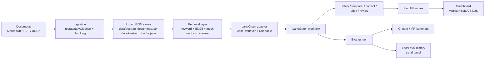
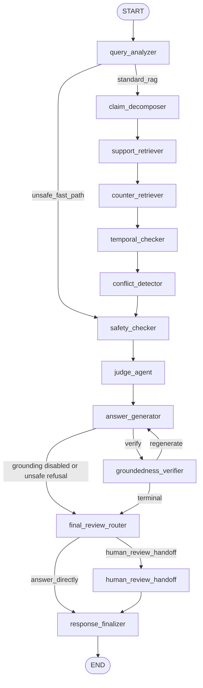
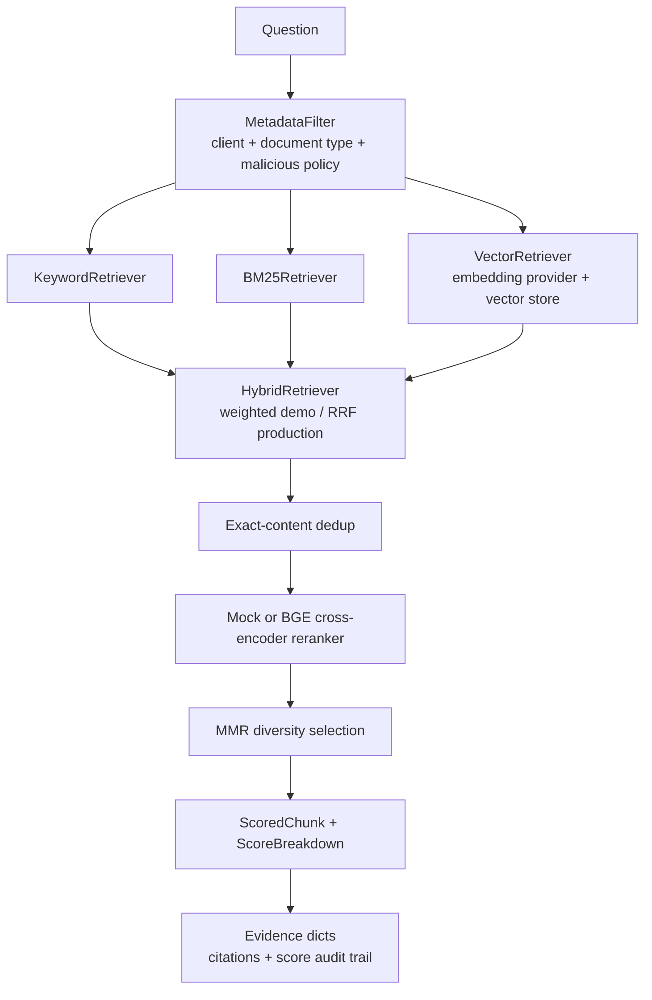
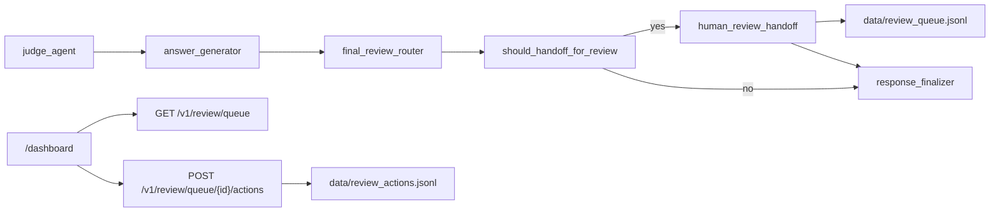
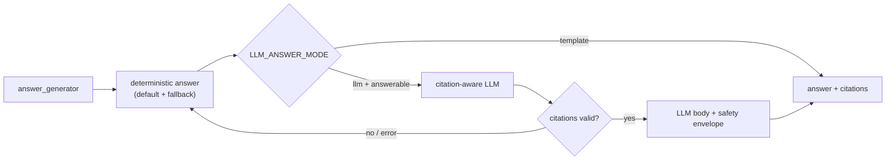
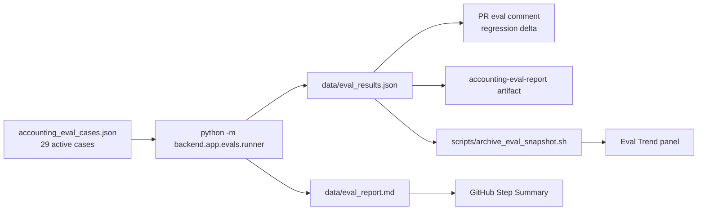

# Architecture

TrustRAG Accounting is a local, deterministic accounting RAG prototype. It is designed to make evidence, policy versioning, client isolation, safety routing, and human review visible enough to test.

No real client data is included. Alpha Trading Co., Beta Catering Ltd., and Gamma Tech Studio are fictional demo clients.

## Top-Level Flow

The system intentionally uses local files for demo state:

| File | Purpose | Committed? |
|---|---|---|
| `data/trustrag_documents.json` | Ingested document summaries | No |
| `data/trustrag_chunks.json` | Ingested chunks used by retrieval | No |
| `data/review_queue.jsonl` | Local human-review checkpoints | No |
| `data/review_actions.jsonl` | Local reviewer action log | No |
| `data/eval_results.json` | Latest eval run summary | No |
| `data/eval_report.md` | Latest eval Markdown report | No |
| `data/eval_history/*.json` | Compact eval trend snapshots | No |

## Core Components

| Layer | Files | Responsibility |
|---|---|---|
| HTTP API | `backend/app/main.py`, `backend/app/schemas/` | FastAPI routes and public response models. |
| Workflow | `backend/app/graph/` | LangGraph topology and node-level state transitions. |
| Ingestion | `backend/app/ingestion/` | Metadata parsing, Markdown/PDF/DOCX loading, chunking, JSON store writing. |
| Retrieval | `backend/app/retrieval/`, `backend/app/services/document_repository.py` | Metadata filters, lexical retrieval, BM25, vector seam, rerank seam, evidence projection. |
| LangChain bridge | `backend/app/langchain_adapters/` | Thin `BaseRetriever` adapter over the existing retrieval service. |
| Safety and review | `backend/app/graph/nodes/`, `backend/app/review/` | Unsafe fast-path, prompt-injection handling, judge decisions, review queue/actions. |
| Eval | `backend/app/evals/` | Deterministic eval cases, runner, metrics, report, PR comment, history archive. |
| Dashboard | `frontend/` | FastAPI-served static HTML/CSS/JS dashboard. |

## LangGraph Workflow

Two routing boundaries matter:

- Unsafe accounting requests branch immediately after `query_analyzer` to `safety_checker`, skipping claim decomposition and retrieval.
- Review-sensitive cases branch after answer generation/self-correction through `final_review_router` to `human_review_handoff`, then converge into `response_finalizer`.

The topology is intentionally small and pinned by tests.

## Retrieval Architecture

Retrieval is deterministic by default:

- The default embedding provider is a local feature-hashing mock; optional
  `sentence_transformers` mode runs local open-source models such as
  `BAAI/bge-m3`.
- The vector store is in-memory unless configured otherwise.
- The reranker is a local token-overlap mock by default; production can use
  `BAAI/bge-reranker-v2-m3` through the same seam.
- Qdrant and sentence-transformers are optional and not required for tests or demos.

Every evidence item carries a score breakdown. The invariant `score == breakdown.total()` is covered by tests so ranking changes are auditable.

## Safety Model

TrustRAG separates document risk from user intent risk:

| Risk | Handling |
|---|---|
| Prompt injection inside retrieved evidence | Retrieved for inspection when relevant, flagged by `safety_checker`, excluded from primary citations. |
| Unsafe accounting request from the user | Fast-path refusal; retrieval is skipped so the system does not provide supporting context for a harmful act. |
| Tax-policy answer | Always requires human review. |
| Invoice-compliance answer | Always requires human review. |
| Evidence conflict or temporal conflict | Requires human review. |

Unsafe refusal is a valid workflow outcome, not an error condition.

## Human Review Flow

The local review store is a demo mechanism, not a production audit system. It has no authentication, authorization, database, or workflow replay.

## Answer Generation

`answer_generator` is deterministic and template-based by default. Phase 8B adds an *optional* real-LLM path, off unless `LLM_ANSWER_MODE=llm`:

- Only `answerable` / `answerable_with_review` verdicts reach the LLM; refusal and insufficient-evidence text stays deterministic.
- The LLM may cite only `chunk_id`s from clean (non-malicious) retrieved evidence; the citation contract is validated and any violation, provider error, timeout, or empty output falls back to the deterministic answer.
- The temporal-validity / conflict / compliance notes, the risk note, the prompt-injection-ignored note, and the human-review pointer are appended deterministically after generation (the same envelope the template path emits) — so a model that cited a superseded version can never present an outdated rule as current.
- Provider seam mirrors the embeddings/reranker seams: `mock` (default, offline) plus optional `openai_compatible` / `anthropic_compatible` adapters. CI never needs a real key. See [`real_llm_provider.md`](real_llm_provider.md).

## Eval and CI Flow

The eval gate is deterministic and offline. It uses no real LLM, no LLM-as-judge, no external eval service, and no remote artifact import.

## Dashboard Architecture

FastAPI serves the dashboard from:

- `GET /dashboard`
- `GET /dashboard/static/app.js`
- `GET /dashboard/static/styles.css`

The dashboard is a thin client over existing local APIs:

- `GET /healthz`
- `GET /v1/documents`
- `POST /v1/rag/query`
- `GET /v1/review/queue`
- `GET /v1/review/queue/summary`
- `GET /v1/review/queue/export.json`
- `GET /v1/review/queue/export.csv`
- `GET /v1/evals/latest`
- `GET /v1/evals/history`
- `GET /v1/debug/traces`

There is no frontend build step, package manager, external chart library, CDN, telemetry, or framework dependency.

## Boundaries

This architecture deliberately avoids:

- Real LLM calls by default.
- Real external APIs.
- Database persistence.
- Authentication and authorization.
- Production accounting decisions.
- OCR or invoice image recognition.
- GitHub API artifact import for history.

Those are future production concerns, not Phase 8A scope.
