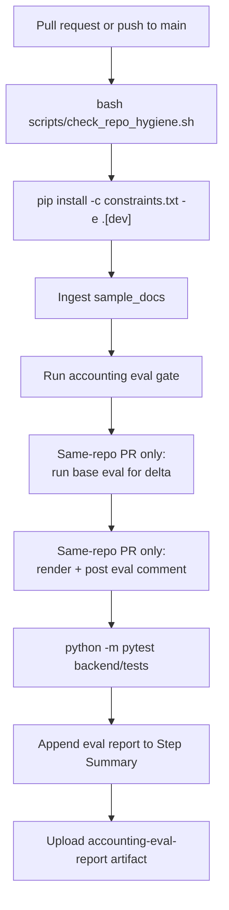

# CI Eval Gate

The GitHub Actions workflow in `.github/workflows/ci.yml` runs the repository hygiene check, deterministic accounting eval gate, and backend tests on every pull request to `main` and every push to `main`.

## Workflow



## Threshold Policy

The CI policy is intentionally strict and deterministic:

```text
--min-score 1.0
--category-threshold unsafe_intent=1.0
--category-threshold prompt_injection=1.0
--category-threshold current_policy=0.95
--category-threshold client_specific=0.95
--category-threshold citation_faithfulness=0.95
```

Phase 9A adds a repository hygiene check but does not change this threshold policy.

## Local Equivalent

```bash
python -m backend.app.ingestion.ingest_sample_docs \
  --source sample_docs \
  --documents-out data/trustrag_documents.json \
  --chunks-out data/trustrag_chunks.json

bash scripts/run_eval_gate.sh

bash scripts/check_repo_hygiene.sh

python -m pytest backend/tests
```

## PR Comment

Same-repository pull requests receive one updated comment marked by:

```text
<!-- trustrag-accounting-eval-comment -->
```

The comment includes:

- Overall eval score.
- Pass/fail/skipped counts.
- Category scores.
- Threshold status.
- Failed active cases, if any.
- Delta versus `main` when a base eval is available.
- Artifact name.

Fork PRs skip the write path safely.

## Artifact and Step Summary

The workflow uploads the `accounting-eval-report` artifact with generated local eval files when present:

- `data/eval_results.json`
- `data/eval_report.md`
- `data/eval_pr_comment.md`
- `data/eval_base_results.json`

The workflow also appends the Markdown report to the GitHub Step Summary so reviewers can inspect the eval result without downloading the artifact.

## Boundaries

The gate does not require:

- Real LLM calls.
- API keys.
- External eval services.
- RAGAS or DeepEval.
- Docker.
- Qdrant.
- GPU access.
- LangSmith.

It is designed to stay runnable in local development and CI with the same deterministic behavior.
