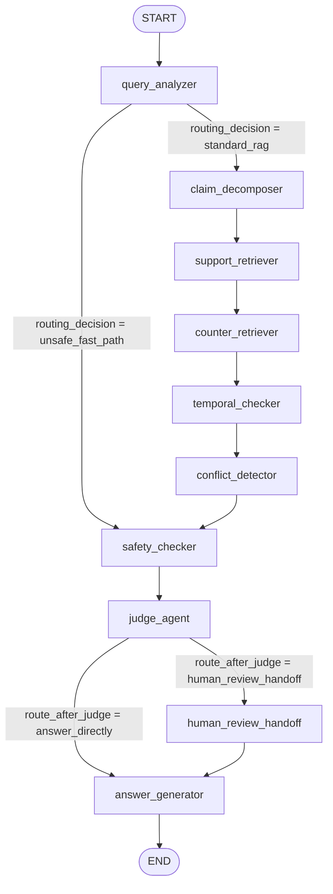
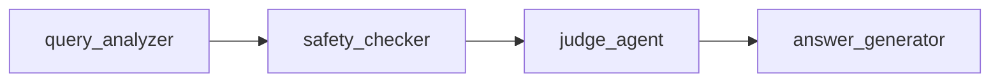

# LangGraph Workflow

TrustRAG Accounting uses a small LangGraph workflow to keep retrieval, safety, human review, and answer generation explicit. Each node returns a partial state update; the graph merges those updates into `TrustRAGState`.

## State Surface

Important state fields include:

| Field | Purpose |
|---|---|
| `question` | Raw user question. |
| `question_type` | One of the accounting question categories, such as `bookkeeping_sop`, `invoice_compliance`, `tax_policy`, or `unsafe_request`. |
| `routing_decision` | Internal branch signal: `unsafe_fast_path` or `standard_rag`. Not exposed in the FastAPI response. |
| `visited_nodes` | Route-aware regression surface appended by each node. |
| `claims` | Structured claim objects used by retrieval and judging. |
| `support_evidence` / `counter_evidence` | Retrieved evidence dictionaries. |
| `temporal_analysis` | Active/outdated policy version analysis. |
| `conflict_analysis` | Policy-family conflict analysis. |
| `safety_analysis` | Prompt-injection and unsafe-intent analysis. |
| `judge_verdict` | Structured conclusion: `answerable`, `answerable_with_review`, `refuse_unsafe`, or `insufficient_evidence`. |
| `human_review_required` / `review_queue_id` | Human-review routing output. |
| `answer` / `citations` | Final response material. |

## Current Topology



## Node Responsibilities

| Node | Responsibility | Current implementation |
|---|---|---|
| `query_analyzer` | Classify question type and set routing decision. | Deterministic keyword/router logic. |
| `claim_decomposer` | Build structured claims with temporal and counter-evidence hints. | Single-claim deterministic decomposition plus comparison hints. |
| `support_retriever` | Retrieve evidence that can support an answer. | LangChain `BaseRetriever` adapter over local hybrid retrieval. |
| `counter_retriever` | Retrieve contradicting, stale, or risk-relevant evidence. | Same adapter path with `stance="counter"`. |
| `temporal_checker` | Select active versions and identify expired versions. | Date and `replaces` metadata logic. |
| `conflict_detector` | Detect policy-family conflicts. | Metadata comparison over retrieved evidence. |
| `safety_checker` | Detect prompt injection and unsafe accounting intent. | Deterministic patterns plus document metadata. |
| `judge_agent` | Produce conclusion, confidence, and review decision signals. | Rule-based judge. |
| `human_review_handoff` | Persist content-safe review checkpoint locally. | JSONL queue under `data/`. |
| `answer_generator` | Assemble refusal, insufficient-evidence, or citation-backed answer. | Deterministic templates. |

## Unsafe Fast-Path

Unsafe accounting questions skip retrieval:



The expected `visited_nodes` list is:

```python
["query_analyzer", "safety_checker", "judge_agent", "answer_generator"]
```

This route is used for tax evasion, invoice fabrication, voucher destruction, and regulator-bypass requests. It refuses the request and offers a compliant alternative without searching the document corpus.

## Standard RAG Path

All non-unsafe accounting questions use the evidence path:

```python
[
    "query_analyzer",
    "claim_decomposer",
    "support_retriever",
    "counter_retriever",
    "temporal_checker",
    "conflict_detector",
    "safety_checker",
    "judge_agent",
    "answer_generator",
]
```

Prompt-injection inspection questions stay on this path. The system needs retrieval so it can surface the adversarial document for inspection, flag it, and avoid using it as primary evidence.

## Human Review Handoff

After `judge_agent`, `route_after_judge` decides whether the workflow should enter `human_review_handoff`.

Review triggers include:

- `tax_policy_always_review`
- `invoice_compliance_always_review`
- `evidence_conflict`
- `temporal_conflict`
- `insufficient_evidence`
- `confidence_below_threshold`
- `judge_requested_review`

Hard exclusions:

- `refuse_unsafe`
- `unsafe_request`

Unsafe refusals do not enter the review queue. They are already final refusal outputs for the local demo.

## LangChain Adapter

`support_retriever` and `counter_retriever` call `build_retrieval_runnable(...)`, which composes:

1. `TrustRAGLangChainRetriever`, a real `langchain_core.retrievers.BaseRetriever`.
2. A `RunnableLambda` that maps LangChain `Document` objects back into the existing TrustRAG evidence dictionary shape.

The adapter does not score, rerank, filter, or rewrite evidence. It delegates to `RetrievalService.search(...)`, so the retrieval behavior remains centralized and deterministic.

## Local Tracing

When `TRUSTRAG_TRACE_ENABLED=true`, retrieval runnables write content-safe start/end/error events into a local ring buffer. Default summaries include counts, chunk IDs, scores, and retrieval strategy, not full document content.

The debug API is read-only except for clearing the local buffer:

- `GET /v1/debug/traces`
- `DELETE /v1/debug/traces`

Remote tracing is intentionally disabled by default.

## Invariants

- The FastAPI response keeps existing fields stable.
- The unsafe route never invokes retrieval nodes.
- The standard route keeps the full evidence path.
- Human-review handoff is additive and does not alter unsafe refusal behavior.
- Retrieval scoring remains inside the retrieval service, not the LangChain adapter.
- Eval and tests pin the route shapes.
