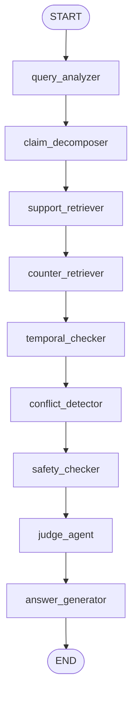
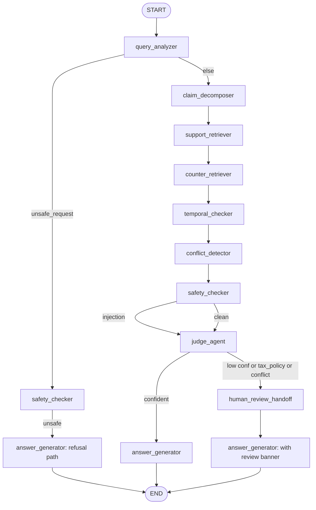

# TrustRAG — LangGraph Workflow (Accounting)

## 1. State Schema

The workflow operates on a single `TypedDict` (see
`backend/app/graph/state.py`). Accounting-specific fields are explicit:

```python
class TrustRAGState(TypedDict, total=False):
    # Input
    question: str

    # query_analyzer
    question_type: str | None              # tax_policy / bookkeeping_sop / ...
    domain: str                            # "accounting"
    needs_temporal_check: bool
    needs_safety_check: bool

    # claim_decomposer
    claims: list[dict]                     # claim_id / claim_text /
                                           # needs_temporal_check /
                                           # needs_counter_evidence

    # support_retriever / counter_retriever
    support_evidence: list[dict]
    counter_evidence: list[dict]

    # temporal_checker / conflict_detector / safety_checker
    temporal_analysis: dict | None
    conflict_analysis: dict | None
    safety_analysis: dict | None

    # judge_agent
    judge_verdict: dict | None             # conclusion + reasoning_summary
    confidence: float | None

    # answer_generator
    answer: str | None
    citations: list[dict]
    needs_human_review: bool

    # Cross-cutting
    errors: list[str]
```

LangGraph merges each node's returned dict into this state, so nodes
only return the fields they actually contribute.

## 2. Node Responsibilities (Accounting Domain)

| Node | Responsibility | MVP impl | Replacement plan |
|------|----------------|----------|------------------|
| `query_analyzer` | Classify into one of 9 accounting question types and emit `needs_temporal_check` / `needs_safety_check`. | Keyword router with priority for unsafe intent. | LLM classifier with entity extraction (client, period, policy family). |
| `claim_decomposer` | Break the question into structured claims with `needs_temporal_check` / `needs_counter_evidence` per claim. | Single-claim passthrough + historical probe for comparison questions. | LLM-driven decomposer that splits multi-part questions. |
| `support_retriever` | Fetch evidence that supports answering. | **Phase 4A**: builds a `TrustRAGLangChainRetriever` (a real `langchain_core.retrievers.BaseRetriever`) via `build_retrieval_runnable(...)` and invokes it. Internally delegates to `DocumentRepository.get_retrieval_service().search(stance="support")`. Same scoring + rerank + filters as Phase 3C; the only change is the *call path* now goes through LangChain's runnable composition. | Real LLM-judge-driven retrieval routing in a Phase 4B / Phase 5 chain. |
| `counter_retriever` | Fetch contradicting / historical evidence. | **Phase 4A**: same adapter path with `stance="counter"`. The workflow-level "auto-detect injection-trigger query" safety policy is re-applied at the node so the malicious chunk still surfaces for `safety_checker`. | Counter-claim generator + dedicated index of superseded versions. |
| `temporal_checker` | Identify the currently effective version using ingested `valid_from`/`valid_to`/`replaces` metadata against an `as_of` date. **Phase 2A**: shifts `as_of` to mid-year when the question mentions a historical year ("2024 年" → 2024-06-30). Uses `replaces` metadata as a hard tie-break edge; emits `temporal_conflict=true` when multiple actives in the same family cannot be disambiguated. | Pure date arithmetic + replaces graph traversal. | Event-time reasoning with audit metadata. |
| `conflict_detector` | Detect version-level contradictions inside a policy family. **Phase 2A**: uses ingested `policy_family` field (no more `doc_id` regex). | Metadata join on `policy_family`. | Claim-level NLI. |
| `safety_checker` | Two passes: (a) prompt-injection in retrieved evidence, (b) unsafe accounting intent in the user question. | Regex + `is_malicious` hint + 4-category intent table. | Real safety classifier + red-team replay harness. |
| `judge_agent` | Produce `judge_verdict.conclusion` (`answerable` / `answerable_with_review` / `refuse_unsafe` / `insufficient_evidence`), `confidence`, `reasoning_summary`. | Rule-based decision tree. | LLM-as-judge with structured rubric. |
| `answer_generator` | Three answer paths: refusal / insufficient / evidence-based. All include the standing risk disclaimer. | Template assembly. | Evidence-conditioned LLM generation with inline citations. |

## 3. Current MVP Workflow



The pipeline is linear: every node runs every time. Conditional routing
(below) is planned for Phase 5.

## 3.1 LangChain Adapter Path (Phase 4A)

The `support_retriever` and `counter_retriever` nodes are the only
two places where Phase 4A changed the *call path* (they did not
change the workflow topology, the state schema, or the response
shape). The node now reads:

```python
def support_retriever(state):
    runnable = build_retrieval_runnable(
        retrieval_service=get_repository().get_retrieval_service(),
        question_type=state.get("question_type"),
        stance="support",
        top_k=5,
        include_malicious=_is_malicious_query(state.get("question") or ""),
    )
    return {"support_evidence": runnable.invoke(state.get("question") or "")}
```

`build_retrieval_runnable` composes a `TrustRAGLangChainRetriever`
(a real `langchain_core.retrievers.BaseRetriever`) with a
`RunnableLambda` that maps `Document → evidence dict`. The retriever
itself does no scoring — it delegates to `RetrievalService.search`
and stamps every returned `Document` with the same `score`,
`score_breakdown`, `retrieval_strategy`, `chunk_id`, parent-document
metadata, and `is_malicious` flag the workflow has been consuming
since Phase 3C.

Why a thin adapter rather than reimplementing retrieval in
LangChain shapes? The retrieval pipeline already has eight
breakdown components, a malicious-cap invariant, and three layered
sub-retrievers — re-doing that math in LangChain would mean
maintaining two scoring implementations. The adapter just *exposes*
the existing math through a LangChain-shaped door, so future
LangChain-native consumers (multi-query retrievers, contextual
compression, LangSmith tracing) get a real `BaseRetriever` to
compose against.

## 3.2 Local Tracing Hooks (Phase 4B)

The runnable built by `build_retrieval_runnable` is always
configured with `run_name` + `tags` + `metadata` via
`Runnable.with_config(...)`, regardless of whether tracing is
enabled. That makes the retrieval call self-describing to any
LangChain-native callback (LangSmith, an internal eval harness,
…), but it doesn't *record* anything by itself.

When `TRUSTRAG_TRACE_ENABLED=true`, the factory additionally wraps
the configured runnable in an explicit recording shim that writes
start / end / error events into the process-wide
`LocalTraceCollector`. The graph nodes pass that collector in via
`maybe_get_trace_collector(settings)`; with the flag off, the
helper returns `None` and the Phase 4A path is preserved verbatim.

Per-node trace surface:

| Node | `run_name` | base `tags` |
|------|-----------|-------------|
| `support_retriever` | `trustrag.support_retriever` | `trustrag`, `accounting`, `retrieval`, `support`, `question_type:<type>` |
| `counter_retriever` | `trustrag.counter_retriever` | `trustrag`, `accounting`, `retrieval`, `counter`, `question_type:<type>` |

Per-event payload:

* `input_summary`: `question_length`, `stance`, `question_type`,
  `top_k`, `include_malicious`. **Never the raw question.**
* `output_summary`: `evidence_count`, `chunk_ids`, `top_score`,
  `retrieval_strategy`, `has_malicious`. **Never full content** —
  set `TRUSTRAG_TRACE_INCLUDE_CONTENT=true` to opt in to 200-char
  previews.

The collector is a thread-safe ring buffer capped at
`TRUSTRAG_TRACE_MAX_EVENTS` (default 100). Older events evict on
overflow — this is a *local debugging aid*, not a durable audit
log. For production audit, future phases would wire an exporter
(LangSmith, Phoenix, OpenTelemetry) behind the same seam.

## 4. Future Conditional Routing (Phase 5)



Planned conditional edges:

- `query_analyzer` → fast-path to `safety_checker` for unsafe intent.
- `judge_agent` → `human_review_handoff` for tax-policy or low-confidence.
- `safety_checker` → `judge_agent` always — the judge decides how to
  react to flagged content.

## 5. Human-in-the-Loop Plan

The MVP already emits `needs_human_review`. Phase 5 will:

- Persist the workflow state in Postgres at the `human_review_handoff`
  boundary.
- Expose a reviewer UI (Phase 6 dashboard) where an accountant can
  approve, rewrite, or reject the draft answer.
- Replay the reviewed verdict back into the eval corpus so the judge's
  thresholds get calibrated against the firm's actual standards.
