# Phase 10: LLM Wiki Compilation Layer — Technical Design

Status: **accepted** — design review completed 2026-07-21; implementation not started.
Review decisions: (1) documentation stays in English; (2) **all** proposals
require human review — the auto-approval path for low-risk pages was
considered and rejected; (3) full 10A–10D scope retained (no compression).
Depends on: Phase 2B ingestion, Phase 3B hybrid retrieval, Phase 5B/7B human review, Phase 8B LLM provider seam, Phase 7D/8E eval + benchmark history infrastructure.

## Summary

Phase 10 inserts a **wiki compilation layer** between the immutable raw corpus
(`sample_docs/`) and the retrieval layer. Instead of only retrieving raw chunks
at query time, an LLM **Ingest Agent** incrementally compiles sources into a
persistent, interlinked markdown wiki (client pages, policy pages with version
lineage, invoice-rule pages), and a **Lint** pass keeps it healthy. Retrieval
can then run over compiled wiki pages, with a two-layer citation chain:
`answer → wiki page → raw source`.

The design implements [Karpathy's LLM Wiki pattern](https://gist.github.com/karpathy/442a6bf555914893e9891c11519de94f)
(2026-04) in the accounting vertical: *"knowledge is compiled once and kept
current, not re-derived on every query."* TrustRAG already has the three
hardest ingredients — temporal/conflict checking, a human review state
machine, and a deterministic eval gate — so the wiki layer slots into
existing seams rather than replacing them.

Why this matters for TrustRAG specifically:

- Cross-document synthesis questions ("compare the 2024 and 2026
  reimbursement rules for Alpha") currently depend on the retriever finding
  every fragment per query. A compiled policy page already contains the
  version lineage and the contradiction notes.
- The wiki gives the review queue something better to review: a *proposed
  knowledge update* with a readable diff, not just a per-query answer.
- It forces the first always-on real-LLM path in the project (ingest cannot
  be templated), while CI stays deterministic via a mock ingest provider —
  the same split already proven by `LLM_ANSWER_MODE` and the provider
  benchmark harness.

## Goals

1. Compile raw sources into a persistent markdown wiki maintained by an LLM
   agent, with staged writes gated by the existing review state machine.
2. Serve RAG queries from the wiki corpus (`RETRIEVAL_SOURCE=wiki|hybrid`)
   with a two-layer citation contract, reusing `HybridRetriever` unchanged.
3. Keep the wiki healthy with a deterministic tier-1 lint (CI-gated) and an
   offline LLM tier-2 lint (manual report, like provider benchmarks).
4. Prove the value with an A/B eval: raw-RAG vs wiki-RAG on the existing 29
   accounting cases (no regression) plus a new `cross_doc_synthesis`
   category (expected win).
5. Preserve every existing trust property: client isolation, temporal
   correctness, prompt-injection quarantine, unsafe fast-path, deterministic
   CI.

## Non-Goals

- Not a general-purpose wiki product or a multi-user knowledge base.
- No direct LLM writes to the wiki for sensitive page types — proposals go
  through review.
- No React frontend in this phase (candidate for Phase 11; the dashboard
  gets a minimal read-only wiki panel only).
- No Postgres migration, no authentication changes, no OCR.
- CI never calls a real LLM. Unchanged from today.

## Pattern → TrustRAG mapping

| Karpathy pattern element | TrustRAG realization |
|---|---|
| Raw sources (immutable) | `sample_docs/` + existing document/chunk JSON stores |
| The wiki (LLM-owned markdown) | `data/wiki/` markdown tree + derived wiki chunk store |
| The schema (conventions file) | `data/wiki/schema.md`, seeded from a committed template |
| Ingest operation | `WikiIngestAgent` — bounded tool-calling loop, staged writes |
| Query operation | Existing LangGraph workflow with `RETRIEVAL_SOURCE=wiki\|hybrid` |
| Lint operation | Tier-1 deterministic checks (CI) + tier-2 LLM report (offline) |
| index.md / log.md | Maintained by the agent, validated by tier-1 lint |
| "Humans in the loop reviewing updates" | Phase 7B review queue + state machine, new `wiki_update` checkpoint type |

## Architecture

```mermaid
flowchart LR
    DOCS["sample_docs/ (immutable)"] --> ING["Existing ingestion<br/>documents + chunks JSON"]
    DOCS --> AGENT["WikiIngestAgent<br/>bounded tool loop (Phase 10B)"]
    ING -.->|read_source_chunks tool| AGENT
    AGENT -->|"WikiUpdateProposal (staged)"| REVIEW["Review queue<br/>Phase 7B state machine"]
    REVIEW -->|approved| APPLY["Proposal applier"]
    APPLY --> WIKI["data/wiki/*.md<br/>+ index.md + log.md"]
    WIKI --> WSTORE["Wiki chunk store<br/>(existing chunker)"]
    WSTORE --> RET["HybridRetriever<br/>RETRIEVAL_SOURCE=raw|wiki|hybrid"]
    RET --> GRAPH["LangGraph workflow (unchanged nodes)"]
    WIKI --> LINT["Wiki lint<br/>tier-1 deterministic / tier-2 LLM"]
    LINT --> REVIEW
    GRAPH --> EVAL["A/B eval + wiki structure eval"]
```



Control-flow split, stated explicitly because it is an interview-grade
decision: the **query path stays a static LangGraph DAG** (analyzable,
testable, already 602-tests-deep). The **ingest path is a dynamic
tool-calling loop** (the agent decides which pages to read and patch per
source). Workflow for the predictable path, agent for the open-ended one.

## Wiki data model

### Directory layout

```text
data/wiki/                      # gitignored, regenerated (repo hygiene rule)
  schema.md                     # conventions the agent must follow (seeded from template)
  index.md                      # content catalog, agent-maintained
  log.md                        # append-only op log: "## [YYYY-MM-DD] ingest | <title>"
  clients/alpha-trading-co.md
  policies/alpha-meal-invoice-booking.md
  invoice_rules/beta-delivery-invoice-description.md
  concepts/small-scale-taxpayer-vat.md
  sources/<doc_id>.md           # one summary page per ingested source
  answers/<slug>.md             # Phase 10D: filed query answers
```

The directory is Obsidian-compatible (`[[wikilink]]` + YAML frontmatter), so
graph view and manual browsing come for free during demos.

A committed **fixture wiki** lives at `backend/tests/fixtures/wiki_fixture/`
(small, hand-curated) so lint and store tests run deterministically in CI
without generating anything.

### Page frontmatter

Parsed with the existing `backend/app/ingestion/frontmatter.py` conventions:

```yaml
---
page_id: policy-alpha-meal-invoice-booking
page_type: policy          # client | policy | invoice_rule | concept | source_summary | answer
title: Alpha Trading Co. meal invoice booking
client: Alpha Trading Co.  # null → global page
status: active             # active | superseded
valid_from: "2026-01-01"
valid_to: null
superseded_by: null        # page_id, when status=superseded
sources:                   # doc_ids from the raw store — the citation bridge
  - alpha_meal_policy_2026
  - alpha_meal_policy_2024
revision: 3
updated: "2026-07-21"
---
```

### Invariants (enforced by tier-1 lint)

1. **Client isolation.** A page with `client: X` may list only sources whose
   document metadata is client X or global. A cross-client `sources` entry is
   a lint error and can never be produced by an approved proposal.
2. **Citation bridge.** Every factual page must have a non-empty `sources`
   list; every `[[wikilink]]` must resolve to an existing `page_id`.
3. **Temporal pairing.** For a given (topic, client) at most one
   `status: active` policy page; superseded pages must carry `superseded_by`.
4. **Index consistency.** Every page appears exactly once in `index.md`;
   `log.md` entries match the `"## [date] op | title"` grammar.

### Derived stores

`backend/app/wiki/store.py` renders approved pages through the existing
`ingestion/chunker.py` + `store_writer.py` into:

- `data/trustrag_wiki_pages.json` — page-level metadata
- `data/trustrag_wiki_chunks.json` — chunk store, same shape as
  `trustrag_chunks.json`, with chunk metadata carrying `page_id`,
  `page_type`, `client`, `status`, and the page's `sources` list

Because the shape matches, `HybridRetriever`, client-aware filters, and the
temporal scorer work on the wiki corpus **without modification**. Wiki
evidence surfaces with the already-reserved `Evidence.source_type="wiki"`
(`backend/app/schemas/rag.py`).

## Ingest Agent (Phase 10B)

### Provider

Reuses the Phase 8B seam (`backend/app/llm/providers.py`). One addition: a
`chat_with_tools(messages, tools) -> ToolCallOrText` method on the provider
protocol, implemented for `openai_compatible` (standard `tools` /
`tool_calls` fields on `/chat/completions`) and for `mock` (scripted
fixture responses). Any OpenAI-compatible endpoint works (DeepSeek, Qwen,
GLM, vLLM, …) — configuration stays `LLM_BASE_URL/LLM_API_KEY/LLM_MODEL`.

### Two-step compile inside one bounded loop

Community implementations of the pattern converged on splitting analysis
from generation (better quality than single-pass; see
[nashsu/llm_wiki](https://github.com/nashsu/llm_wiki)). The agent run for
one source is:

```text
Step A — ANALYZE (read-only)
  loop (≤ WIKI_INGEST_MAX_TOOL_CALLS/2):
    tools: search_wiki_index | read_wiki_page | read_source_chunks
  must end with: submit_analysis(AnalysisResult)
    AnalysisResult: entities, affected_page_ids, new_page_specs,
                    contradictions[], temporal_changes[], notes

Step B — PATCH (staged writes only)
  loop (≤ WIKI_INGEST_MAX_TOOL_CALLS/2):
    tools: read_wiki_page | stage_page_upsert | stage_index_update
  must end with: finish_ingest(summary)
```

Loop mechanics (hand-written, ~150 lines, `backend/app/wiki/ingest_agent.py`):

- `while` over provider calls; dispatch `tool_calls` against pure functions
  in `wiki/tools.py`; append tool results; stop on the terminal tool, the
  call cap, or the token budget — whichever first.
- Malformed tool arguments get one structured retry (error fed back as the
  tool result), then the run fails closed: no proposal, error logged.
- Tool results are **data, never instructions** — the system prompt states
  this, and no tool can execute content (no shell, no eval, no network).

### Staged writes and review

`stage_page_upsert` never touches disk. The run's output is one
`WikiUpdateProposal`:

```python
class WikiUpdateProposal(BaseModel):
    proposal_id: str
    source_doc_id: str
    source_content_hash: str          # idempotency key
    analysis: AnalysisResult
    patches: list[PagePatch]          # page_id, page_type, new_content, diff
    risk: Literal["low", "sensitive"]
    created_at: str
```

Routing policy (per design review, 2026-07-21): **every proposal is enqueued
as a `wiki_update` checkpoint in the Phase 7B review queue — there is no
auto-apply path.** The existing state machine applies unchanged (`approve` →
applier runs; `reject` → discarded; `changes_requested` → held; `reopen`
supported). The dashboard renders the patch diffs.

The `risk` field remains as a triage signal only: `sensitive` (patches
touching `policy`, `invoice_rule`, or `client` pages, or any flagged
contradiction) sorts ahead of `low` (`concept` / `source_summary`-only
patches) in the queue, and the dashboard may offer multi-select approval
for `low` items to keep ingest throughput practical. Neither level
bypasses review.

The **applier** (`wiki/apply.py`) is the only writer: writes markdown,
bumps `revision`, updates `index.md`, appends `log.md`, refreshes the wiki
JSON stores. Files under `data/wiki/` therefore always reflect approved
state only.

### Safety and hygiene

- **Prompt-injection:** documents quarantined by the existing corpus-risk
  flag are never passed to the agent. A dedicated eval case ingests an
  injection document and asserts (a) no instruction text lands in any patch,
  (b) the quarantined doc never appears in `sources`.
- **Idempotency:** `source_content_hash` is recorded per applied proposal;
  re-ingesting an unchanged source is a no-op unless `--force`.
- **Cost bounds:** per-run tool-call cap, token budget, and a per-run token
  usage line in `log.md` (mirrors the latency/fallback bookkeeping of the
  provider benchmark).
- **Mock mode:** `WIKI_INGEST_MODE=mock` replays fixture proposals — this is
  what CI and `backend/tests/wiki/` use. Real-LLM ingest is a manual/local
  operation, exactly like `LLM_ANSWER_MODE=llm`.

## Query path v2 (Phase 10C)

- `RETRIEVAL_SOURCE=raw|wiki|hybrid` (env default) + optional per-request
  override on `POST /v1/rag/query`. `raw` remains the default until the A/B
  eval clears; the LangGraph node graph is unchanged.
- `wiki`: `HybridRetriever` runs over the wiki chunk store.
- `hybrid`: both corpora retrieved; fusion adds a small wiki-affinity bonus
  for synthesis-type questions (`temporal_policy_comparison`, `risk_review`)
  via the existing `score_breakdown` mechanism (new component key
  `wiki_affinity`, additive and explainable like the others).
- **Two-layer citations** — additive, back-compatible fields on the citation
  model in `schemas/rag.py`:

```python
citation_layer: Literal["source", "wiki"] = "source"
wiki_page_id: str | None = None
underlying_doc_ids: list[str] = []   # from the wiki page's frontmatter sources
```

  The citation-faithfulness validator gains one rule: a `wiki`-layer citation
  is valid only if its `underlying_doc_ids` is non-empty and every id exists
  in the raw document store — an answer can never be grounded in a wiki page
  that is not itself grounded.

## Lint (Phase 10A tier-1, Phase 10D tier-2)

**Tier-1 (deterministic, CI-gated, `wiki/lint.py`):** the four invariants
above, plus orphan-page detection (no inbound wikilinks) and stale-active
detection (two active pages, same topic+client, overlapping validity).
Pure-Python graph walk over frontmatter + links; runs on the committed
fixture wiki in CI and on `data/wiki/` locally via
`scripts/run_wiki_lint.sh`. Output: `data/wiki_lint_report.json` + `.md`.

**Tier-2 (LLM, offline, manual):** semantic contradiction scan across page
pairs sharing a topic; missing-page suggestions (concepts mentioned ≥3
times without a page). Same operational stance as the provider benchmark:
manual script, artifact + history snapshot, dashboard read-only panel,
**never** a CI gate. Findings above a severity bar can be enqueued as
`wiki_lint` review items.

## Evaluation plan

| Eval | Mode | Where it runs | Gate? |
|---|---|---|---|
| Wiki structure eval: fixture sources → mock ingest → apply → tier-1 lint clean + expected page set exists | deterministic | CI | **Yes** |
| Existing 29 accounting cases, `RETRIEVAL_SOURCE=raw` | deterministic | CI | **Yes** (unchanged) |
| Existing 29 cases, `RETRIEVAL_SOURCE=wiki` over fixture wiki | deterministic | CI | **Yes**: no regression vs raw thresholds |
| `cross_doc_synthesis` cases (new category, ~8 cases: version comparison, multi-source aggregation, cross-policy interaction) | deterministic keys | CI (raw) + CI (wiki) | Report-only first, promoted to gate once stable |
| Real-LLM A/B benchmark: raw vs wiki vs hybrid on full case set; correctness keys, citation validity, fallback rate, latency, token cost | real LLM | manual, `scripts/run_wiki_ab_benchmark.sh` | No — artifact + history snapshot (Phase 8E pattern) |
| Ingest fidelity smoke: one real source → real ingest → key facts present in patched pages (keyword assertions) | real LLM | manual smoke, like `run_real_provider_smoke.py` | No |

The A/B benchmark is the phase's headline artifact: it either demonstrates
the pattern's value on synthesis questions with numbers, or honestly shows
where compiled retrieval does not help — both outcomes are reportable.

## API additions

| Endpoint | Method | Notes |
|---|---|---|
| `/v1/wiki/pages` | GET | List page metadata (filter by `page_type`, `client`, `status`) |
| `/v1/wiki/pages/{page_id}` | GET | Page content + frontmatter + resolved links |
| `/v1/wiki/graph` | GET | Nodes + wikilink edges for the dashboard panel |
| `/v1/wiki/lint/latest` | GET | Latest lint report artifact (read-only) |
| `/v1/wiki/ingest` | POST | Trigger ingest for a source (local mode only; **disabled in public demo**, like reviewer writes) |
| `/v1/rag/query` | POST | Gains optional `retrieval_source` field |

Public-demo mode: all wiki write/trigger endpoints disabled; read endpoints
allowed — consistent with the existing `DemoConfigResponse` capability-flag
pattern.

## Configuration additions (`.env.example` style)

```bash
# ---- LLM Wiki compilation layer (Phase 10) ----
# The wiki layer is OPTIONAL and OFF by default. With WIKI_INGEST_MODE=mock
# (default) the ingest agent replays deterministic fixture proposals and no
# API key / network is needed — this is what CI and the test suite always
# use. Set WIKI_INGEST_MODE=llm to compile with a real provider (reuses
# LLM_BASE_URL / LLM_API_KEY / LLM_MODEL). Every staged proposal routes
# through the human review queue before anything is written to
# data/wiki/ — there is no auto-apply path.
WIKI_ENABLED=false
WIKI_DIR=data/wiki
WIKI_INGEST_MODE=mock            # mock | llm
WIKI_INGEST_MAX_TOOL_CALLS=20
WIKI_INGEST_MAX_TOKENS=60000
# raw (default) | wiki | hybrid — retrieval corpus for /v1/rag/query
RETRIEVAL_SOURCE=raw
```

## Module layout

```text
backend/app/wiki/
  __init__.py
  models.py         # WikiPage, WikiFrontmatter, AnalysisResult, PagePatch, WikiUpdateProposal
  store.py          # markdown read/write + wiki JSON store refresh (reuses ingestion chunker/store_writer)
  index.py          # index.md + log.md maintenance and parsing
  tools.py          # agent tool schemas + pure-function dispatch
  prompts.py        # system prompt, schema.md template, step prompts
  ingest_agent.py   # bounded two-step tool loop
  apply.py          # proposal applier (only writer)
  lint.py           # tier-1 deterministic checks
  lint_llm.py       # tier-2 offline semantic checks (Phase 10D)
backend/tests/wiki/                      # store, lint, loop (mock provider), apply, isolation tests
backend/tests/fixtures/wiki_fixture/     # committed mini-wiki for CI
scripts/run_wiki_lint.sh
scripts/run_wiki_ab_benchmark.sh
```

Estimated new code: ~2.5–3.5k lines including tests — comparable to one
existing mid-sized phase.

## Decision log

1. **Markdown files as source of truth, JSON stores derived.** Chosen for
   Obsidian compatibility, human-readable review diffs, and git-friendly
   history; the derived chunk store keeps `HybridRetriever` unchanged.
   Rejected: DB-only pages (opaque to reviewers, breaks the pattern's
   file-centric ergonomics).
2. **Hand-written bounded tool loop for ingest.** The query path keeps
   LangGraph (static, analyzable). Ingest is inherently dynamic — the agent
   chooses which pages to read/patch. Rejected: modeling ingest as a
   LangGraph DAG (fixed fan-out fights the task) and **OpenAI Agents SDK**
   (evaluated: mature in Python, but its orchestration/guardrails/tracing
   duplicate LangGraph + existing safety nodes + local tracing; a second
   orchestration framework in one repo weakens the architecture story, and
   the loop itself is ~150 lines we want full control over).
3. **Staged proposals + human review for every write — no direct writes,
   no auto-apply.** Extends the project's core trust posture to knowledge
   maintenance; reuses the Phase 7B state machine instead of inventing a
   parallel approval flow. An auto-approval path for low-risk page types
   was considered and rejected at design review (2026-07-21): uniform
   review keeps the audit story simple, at the cost of reviewer
   throughput (mitigated by risk-sorted queueing and batch approval UX).
4. **Index-first navigation for the agent, hybrid retrieval for queries.**
   The agent navigates via `index.md` (Karpathy's approach, cheap and
   transparent); user queries reuse the existing BM25+keyword+vector
   fusion because that infrastructure already exists and is tested.
5. **Wiki under gitignored `data/`, fixture wiki committed under tests.**
   Follows the repo hygiene rule (regenerated artifacts never committed)
   while keeping CI deterministic.

## Risks and mitigations

| Risk | Mitigation |
|---|---|
| Hallucinated or destructive page edits | Staged proposals; human review gate for every proposal; tier-1 lint on apply; `revision` + log for rollback |
| Reviewer throughput becomes the ingest bottleneck | Risk-sorted queue; batch approval UX for `low`-risk proposals; ingest stays a manual, low-volume operation at demo scale |
| Prompt injection via source documents | Quarantine exclusion; data-not-instructions prompt contract; no executable tools; dedicated eval case |
| Real-LLM cost during development | Tool-call/token caps; per-run cost line in log; mock mode for all tests; ingest is manual, never CI |
| Wiki drifts from corpus over time | Idempotency hashes; lint stale/orphan checks; re-ingest with `--force` regenerates |
| Provider variance breaks the loop | Structured-output retry-once-then-fail-closed; two-step split reduces long-generation failures; fallback = no proposal (never partial writes) |
| Scale (index.md navigation degrades) | Fine at demo scale (~10² pages, per pattern doc); future: qmd-style local search tool — documented seam, not built now |

## Milestones and acceptance criteria

**10A — Wiki store, lint tier-1, mock ingest (weeks 1–2)**
`wiki/` models + store + index/log + tier-1 lint + fixture wiki + mock
ingest end-to-end (fixture source → proposal → apply via a test-driven
approval → lint clean; the real review-queue wiring lands in 10B).
*Accept:* wiki structure eval green in CI; `pytest backend/tests` green;
fixture wiki opens in Obsidian with working links.

**10B — Real ingest agent + review integration (weeks 3–4)**
Provider `chat_with_tools`, two-step loop, staged proposals, `wiki_update`
checkpoints in the review queue, dashboard diff rendering, injection eval
case, idempotency.
*Accept:* one real source compiled end-to-end locally with review approval;
injection case green; CI still fully offline.

**10C — Wiki retrieval + two-layer citations + A/B (weeks 5–6)**
Wiki chunk store in `HybridRetriever`, `RETRIEVAL_SOURCE`, citation fields +
validator rule, `cross_doc_synthesis` cases, A/B benchmark script + history
snapshots, dashboard read-only wiki/graph panel.
*Accept:* 29/29 no-regression in wiki mode on fixture wiki (CI); A/B report
artifact generated with real provider locally.

**10D — Tier-2 lint, answer filing, and showcase polish (weeks 7–8)**
Tier-2 LLM lint report, answer filing (`answers/` pages via review),
demo-walkthrough + README updates, roadmap entry. React/TS wiki explorer is
explicitly deferred to a Phase 11 proposal.
*Accept:* lint tier-2 artifact renders in dashboard; docs updated.

## What this phase is not

- Not a rewrite of the query workflow — LangGraph nodes are untouched
  except the retrieval-source seam.
- Not an autonomous system: every knowledge change requires human
  approval, by design.
- Not a claim that compiled retrieval always beats raw RAG — the A/B
  harness exists to measure exactly that, honestly.

## References

- Karpathy, *LLM Wiki* pattern: https://gist.github.com/karpathy/442a6bf555914893e9891c11519de94f
- Two-step ingest precedent: https://github.com/nashsu/llm_wiki
- Internal: `docs/architecture.md`, `docs/langgraph_workflow.md`,
  `docs/eval_design.md`, `docs/real_llm_provider.md`,
  `docs/provider_benchmark.md`, `docs/dashboard.md`
