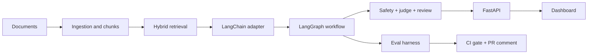

# TrustRAG Accounting Showcase

## 30-Second Summary

TrustRAG Accounting is an evidence-grounded RAG prototype for accounting-firm workflows. It answers against fictional client SOPs, invoice rules, reimbursement policies, and tax notes while preserving client isolation, policy versioning, unsafe-request refusal, prompt-injection quarantine, human review, and deterministic eval coverage.

## Core User Story

An accountant asks whether a transaction, reimbursement, invoice, or policy interpretation can be handled under a client-specific rule. TrustRAG retrieves the relevant evidence, checks whether the policy is current, looks for counter-evidence, detects safety risks, decides whether human review is required, and returns an answer with citations and review metadata.

## System Capabilities

- Multi-format ingestion for Markdown, PDF, and DOCX sample documents.
- Chunk-level metadata for client, policy family, version, dates, and safety flags.
- Hybrid retrieval with keyword, BM25, deterministic mock vector retrieval, and mock reranking.
- LangChain `BaseRetriever` adapter without duplicating scoring logic.
- LangGraph workflow with unsafe fast-path routing.
- Human review handoff, local queue, reviewer actions, filtering, pagination, and export.
- Dashboard served by FastAPI with vanilla HTML/CSS/JS.
- Deterministic eval harness, CI gate, PR eval comments, and local eval trend snapshots.

## Architecture Highlights



Key implementation choices:

- Retrieval scoring stays centralized in `RetrievalService`.
- The LangChain adapter is a thin compatibility layer.
- The dashboard uses existing HTTP APIs and requires no frontend build system.
- Local JSON/JSONL files make the demo inspectable and easy to reset.

## Safety Highlights

- Client-named questions filter retrieval by client.
- Unsafe user intent skips retrieval and returns a refusal.
- Prompt injection in the corpus is treated as document risk and flagged for review.
- Tax and invoice compliance answers require human review.
- Review checkpoints store evidence summaries by default, not full document content.
- No real client data is included.

## Evaluation Highlights

- 18 active deterministic eval cases.
- 7 accounting-focused categories.
- Current baseline: 18/18 passing, score `1.000`.
- CI enforces overall and category thresholds.
- PR comments show score, category results, failed cases, artifact reference, and delta versus `main`.
- Local eval history snapshots feed the dashboard Eval Trend panel.

## Dashboard Highlights

- Query console for demo questions.
- Evidence, citation, temporal, conflict, and safety inspection.
- Human review queue with reviewer actions and action history.
- Filtering, pagination, summary cards, and JSON/CSV export.
- Latest eval report viewer.
- Eval Trend panel with lightweight SVG/CSS visualization.
- Local trace viewer when enabled.

## Interview Talking Points

- Accounting RAG needs evidence and human review because the risk is often "right answer, wrong source" rather than bad prose.
- Client isolation matters because a correct Alpha SOP answer can be a harmful Beta answer.
- Unsafe fast-path skips retrieval so the system does not gather helpful context for tax evasion, invoice fabrication, voucher destruction, or regulator bypass.
- Prompt injection is treated as document risk because the malicious instruction lives in the corpus, not in the user request.
- Deterministic evals came before real provider evals because CI needs stable structural regression checks.
- The dashboard is FastAPI-served vanilla JS because the demo needs inspectability and low dependency weight more than a frontend build stack.

## Demo Script

```bash
python -m backend.app.ingestion.ingest_sample_docs \
  --source sample_docs \
  --documents-out data/trustrag_documents.json \
  --chunks-out data/trustrag_chunks.json

bash scripts/run_eval_gate.sh
bash scripts/archive_eval_snapshot.sh
bash scripts/run_dev.sh
```

Open:

```text
http://localhost:8000/dashboard
```

Run the 5-8 minute walkthrough in [`demo_walkthrough.md`](demo_walkthrough.md).
